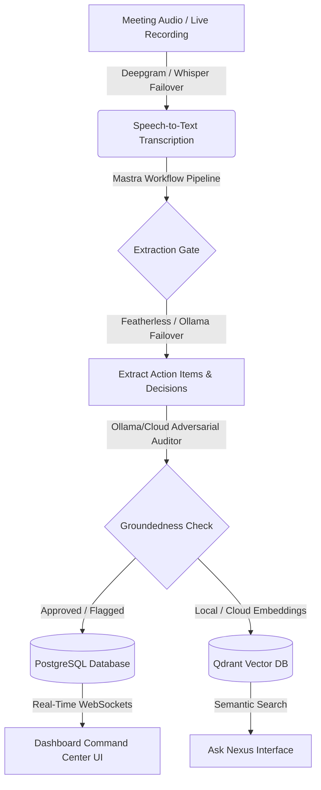

# Nexus: Local-First AI Meeting Workspace

[](#)
[](#)
[](#)
[](#)

Nexus (Synapse) is a hybrid, local-first meeting capture, transcription, and action item validation workspace. Designed for developer teams, Nexus uses local and cloud AI orchestration to capture meetings, generate accurate transcripts, validate action items against adversarial AI critics, and organize commitments in a real-time dashboard.

---

## 1. System Architecture & Flows

For a detailed architectural deep-dive, see the [Architecture Specification](file:///d:/mastra%20(nexus)/architecture.md).



---

## 2. Key Features

* **Hybrid Execution Bridge**: Run the project as a native **Electron Desktop Application** or as a cloud-served **Express Web Application** utilizing a shared, environment-aware API bridge.
* **Failover Transcription Engine**: High-fidelity transcriptions using cloud **Deepgram** that automatically fail over to local **Whisper offline** (or mock dev fallback) if API quotas are exceeded.
* **Failover LLM Engine (Featherless AI + Ollama)**: Orchestrated meeting analysis powered primarily by cloud-hosted open-source models via **Featherless API** (`Meta-Llama-3-8B-Instruct`), which fails over to local **Ollama** (`qwen2.5:14b`) during outages or quota errors.
* **Adversarial Validation Gate**: Double-model cross-checks validating draft commitments against literal transcripts to flag hallucinations and unconfirmed assertions.
* **Vector Memory (Qdrant)**: Semantic search memory allowing you to ask queries across past meetings, find evolving trends, and check dependencies.
* **Local Audio Storage**: Strict data sovereignty. Audio files are copied directly to local user data directories rather than cloud buckets, keeping data private.

---

## 3. Technology Stack & Integrations

For a guide explaining the purpose of each technology, see the [Core Technologies Guide](file:///d:/mastra%20(nexus)/technologies-guide.md).

* **Mastra**: Orchestrates our multi-stage AI pipelines, agents, and tool execution.
* **Qdrant**: Stores high-dimensional semantic vectors for past meeting transcripts.
* **Enkrypt AI**: Ensures validation safety and groundedness of action items.
* **Featherless AI**: Hosts cloud serverless open-source models with OpenAI compatibilities.

---

## 4. Getting Started

### Installation
1. **Clone the Repository**:
   ```bash
   git clone https://github.com/Jagadesh-1811/nexus-.git
   cd nexus-
   ```
2. **Install Dependencies**:
   ```bash
   npm install
   ```
3. **Configure Environment Variables**:
   Create a `.env` file at the root (and `/backend/.env`) using the Configuration guide below.
4. **Generate Prisma Clients**:
   ```bash
   npx prisma generate --schema=prisma/schema.prisma
   npx prisma generate --schema=backend/prisma/schema.prisma
   ```

### Running Locally
* **Electron Desktop Version**:
   ```bash
   npm run electron:dev
   ```
* **Web Server Version**:
   ```bash
   npm run build
   cd backend
   npm install && npm run build
   node dist/index.js
   ```

---

## 5. Environment Configuration

Create a `.env` file at the root:

```env
# Database Connection (Ensure to URL-encode password special characters)
DATABASE_URL="postgresql://[user]:[password]@[host]:6543/postgres?pgbouncer=true"
DIRECT_URL="postgresql://[user]:[password]@[host]:5432/postgres"
JWT_SECRET="your-jwt-secret-hash"

# Featherless AI Configuration
FEATHERLESS_API_KEY="your-featherless-api-key"
FEATHERLESS_BASE_URL="https://api.featherless.ai/v1"
FEATHERLESS_MODEL="meta-llama/Meta-Llama-3-8B-Instruct"

# Ollama Local Configuration
OLLAMA_HOST="http://127.0.0.1:11434"
OLLAMA_BASE_URL="http://127.0.0.1:11434/v1"
OLLAMA_MODEL="qwen2.5:14b"
OLLAMA_AUDITOR_MODEL="qwen2.5:14b"

# Transcription API
DEEPGRAM_API_KEY="your-deepgram-api-key"

# Vector DB
QDRANT_URL="https://your-qdrant-url.qdrant.io"
QDRANT_API_KEY="your-qdrant-api-key"
QDRANT_COLLECTION="synapse_meetings"
```

---

## 6. The Team

* **Jagadeeshwar C V**
* **Shyam Yemuka**
