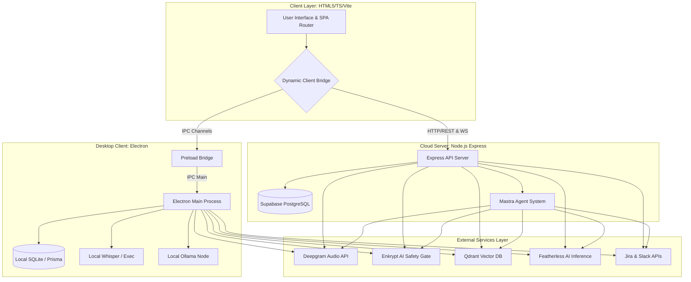
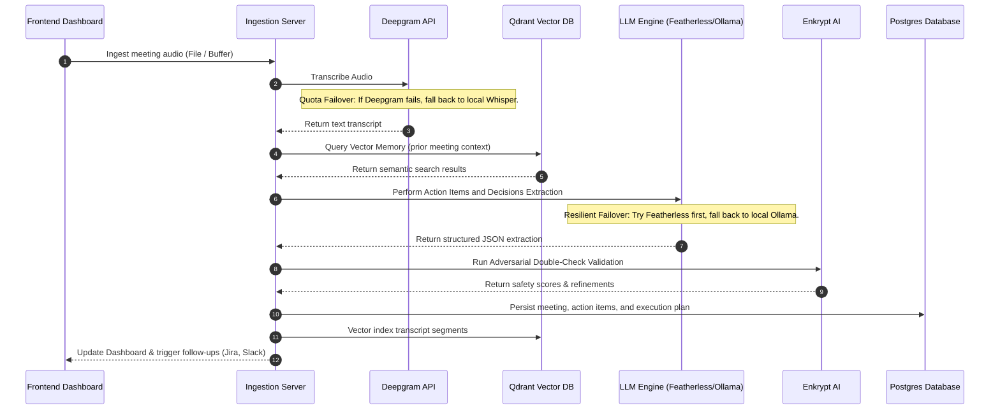

# Nexus: System Architecture Specification

This document details the architectural layout, data flows, and structural design of the **Nexus (Synapse)** platform.

---

## 1. High-Level Architectural Layout

Nexus is designed as a **hybrid, local-first meeting intelligence application** capable of running either as a desktop application (compiled via Electron) or a cloud-hosted web application (served via Express). 

---

## 2. Component Layout & Process Roles

### 2.1 The Dynamic Client Bridge
The frontend does not communicate directly with the network or IPC hooks. Instead, it relies on a shared `synapse` client instance which implements a unified bridge interface.
* **Electron Mode**: Proxies all requests to `window.synapse` which routes them through Electron's `contextBridge` using IPC requests.
* **Web Mode**: Maps the same calls to asynchronous REST fetch requests and WebSockets communicating with the Express API.

### 2.2 Electron Main Process
Runs locally on the user's machine. It acts as the orchestrator of all desktop-level APIs, database connections, and local hardware hooks:
* **Background Auto-Capture**: Regularly queries active OS processes via PowerShell (Windows) or shell utilities (macOS) to identify if a virtual meeting is running (e.g. Zoom, MS Teams, Google Meet, Webex) and handles local background microphone recording.
* **Database Client**: Instantiates Prisma directly to query the local SQLite or remote PostgreSQL instance in-process.

### 2.3 Express Backend API
A secure, production-grade Express server configured with:
* **Helmet & CORS Security Policies**: Protects the API routes from cross-site scripts and restricts access to designated origins.
* **WebSocket Server**: Maintained on the same HTTP port to broadcast real-time compilation, transcription, and agent extraction status updates back to the client interface.

---

## 3. Data Flow: Meeting Ingestion Pipeline

When a meeting recording is ingested (either uploaded or captured live), it undergoes a multi-layered extraction and validation workflow:

---

## 4. Database Schema Design (Prisma)

The application tracks workspaces, user roles, meeting transcripts, and AI-extracted actions using the following entity relationship model:

* **User**: Manages credentials, roles (LEAD, EXECUTIVE, VIEWER), and authentication mapping.
* **Workspace**: Supports multi-tenant organizational structure. Users join workspaces via **WorkspaceMember** records.
* **Meeting**: Core record tracking titles, dates, file sizes, local storage locations, status (PENDING, TRANSCRIBING, ANALYZING, VALIDATING, COMPLETED, FAILED), and raw/encrypted transcripts.
* **ActionItem**: Extracted tasks containing priority markers (LOW, MEDIUM, HIGH, CRITICAL), assignees, deadlines, and validation metrics (enkryptValidationScore, approvedById, status).
* **Decision**: Definite decisions extracted from meeting discussions tracking stakeholders and reversibility.
* **Risk**: Logged project risks, mitigation steps, and assigned owners.
* **ExecutionPlan**: High-level execution summaries generated by the agent containing overall safety scores.
